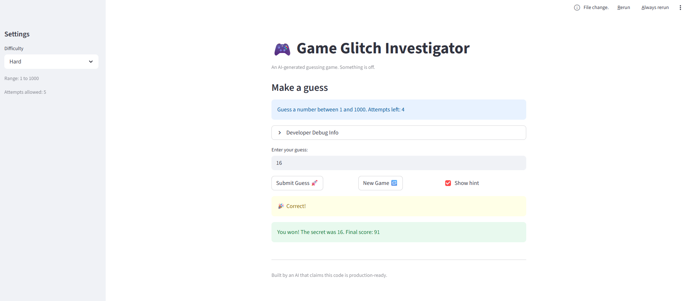

# 🎮 Game Glitch Investigator: The Impossible Guesser

## 🚨 The Situation

You asked an AI to build a simple "Number Guessing Game" using Streamlit.
It wrote the code, ran away, and now the game is unplayable. 

- You can't win.
- The hints lie to you.
- The secret number seems to have commitment issues.

## 🛠️ Setup

1. Install dependencies: `pip install -r requirements.txt`
2. Run the broken app: `python -m streamlit run app.py`

## 🕵️‍♂️ Your Mission

1. **Play the game.** Open the "Developer Debug Info" tab in the app to see the secret number. Try to win.
2. **Find the State Bug.** Why does the secret number change every time you click "Submit"? Ask ChatGPT: *"How do I keep a variable from resetting in Streamlit when I click a button?"*
3. **Fix the Logic.** The hints ("Higher/Lower") are wrong. Fix them.
4. **Refactor & Test.** - Move the logic into `logic_utils.py`.
   - Run `pytest` in your terminal.
   - Keep fixing until all tests pass!

## 📝 Document Your Experience

- [x] Describe the game's purpose.
     The purpose of the game is to let the player guess a hidden number within a selected range. The game gives feedback after each guess.
- [x] Detail which bugs you found.
     I found out that the game had issues with its logic and behavior. The "higher" and "lower" were not working perfectly, which could confuse the player. There were also problem with how parts of the logic were organized, making the code harder to test and maintain. 
- [x] Explain what fixes you applied.
     I fixed the incorrect higher/lower hintlogic so the game now gives the right feedback to the player.I also moved the main game logic into 'logic_utils.py'to make the program cleaner and easier to test. After that, I ran the test with 'pytest' and confirmed that the game worked correctly.

## 📸 Demo

- [x] 

## 🚀 Stretch Features

- [x] [pytest_result](pytest_result.png)
